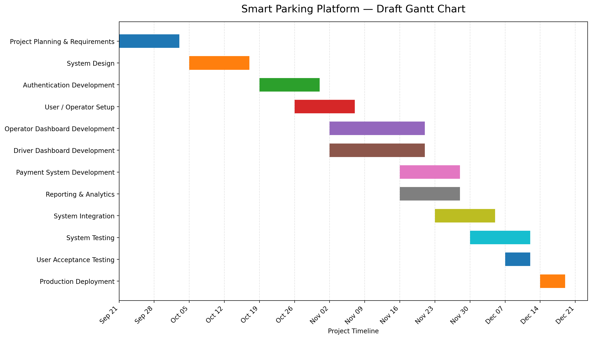

# Initial Project Vision and Scope

## 1. Existing Software Landscape

Several parking applications currently exist to help drivers locate and pay for
parking. Examples include ParkHouston, SpotHero, ParkWhiz,
and AirGarage. These platforms provide various features for both drivers 
and facility operators such as mobile parking payments, parking reservations,
facility management, and occupancy monitoring.

The Smart Parking Platform will build on these concepts by creating a
single system connecting drivers and parking facility operators.

## 2. Project Vision and Scope

The vision of the Smart Parking Platform is to simplify the process of
finding, navigating, and paying for parking. Drivers will
be able to view parking availability in real time, receive navigation assistance, 
and pay through a web or mobile application.

The platform will also provide parking operators with tools to monitor
occupancy, manage surveillance, and deal with reports.

The initial scope includes a web and mobile platform with user accounts,
an interactive map, digital payments, notifications, and navigation integration. 
Parking operators will have access to an administrative dashboard containing
occupancy and reporting tools.

The initial project will use Houston as a pilot market while being
designed so that the platform could later expand to other cities.

## 3. Draft of SRS
Software Requirements Specification
Smart Parking Platform
Version 1.1
Date: 09.17.2026

1. Existing Software Landscape
   - ParkHouston
   - SpotHero
   - ParkWhiz
   - AirGarage
   - How our proposed system differs

2. Vision and Scope
   - WE ARE $oftware ¢orp.
   - Project Acquisition
   - Project Vision
   - Preliminary Scope

3. SRS
   - Purpose
   - Scope
   - Overall Description
      - Users
       - System Environment
       - Constraints
       - Assumptions
   - Functional Requirements
   - Non-Functional Requirements
### 3.1 Use Cases

   1. User Registration
   2. User Login and Authentication
   3. Search for Parking
   4. View Real-Time Parking Availability
   5. View Parking Locations on Interactive Map
   6. View Parking Facility Details
   7. Save and Modify Payment Methods
   8. Navigate to a Parking Facility
   9. Pay for Parking
   10. View and Download Payment Receipts
   11. Receive Parking Notifications and Alerts
   12. Parking Operator Manages Parking Availability
   13. Parking Operator Views Occupancy Analytics
   14. Parking Operator Manages Pricing
   15. System Administrator Manages User Accounts

---

# 4. Project Work Setup

## 4.1 Work Breakdown Structure (WBS)

The following Work Breakdown Structure divides the Smart Parking Platform
into major development components and the tasks required to complete them.

### 1.0 Smart Parking Platform

#### 1.1 Authentication
- 1.1.1 User Registration
- 1.1.2 User Login
- 1.1.3 Password Recovery
- 1.1.4 Session Management

#### 1.2 User / Operator Setup
- 1.2.1 Driver Account Setup
- 1.2.2 Driver Profile Information
- 1.2.3 Vehicle Information
- 1.2.4 Operator Account Setup
- 1.2.5 Payment Information Setup

#### 1.3 Dashboards

##### 1.3.1 Operator Dashboard
- 1.3.1.1 Add Parking Garage
- 1.3.1.2 Edit Parking Garage
- 1.3.1.3 Remove Parking Garage
- 1.3.1.4 Monitor Garage Occupancy
- 1.3.1.5 Manage Parking Availability
- 1.3.1.6 Manage Parking Pricing

##### 1.3.2 Driver Dashboard
- 1.3.2.1 Search for Parking
- 1.3.2.2 View Real-Time Parking Availability
- 1.3.2.3 View Parking Facility Details
- 1.3.2.4 Select Parking Facility
- 1.3.2.5 Navigate to Parking Facility
- 1.3.2.6 Pay for Parking

#### 1.4 Payment Processing
- 1.4.1 Add Payment Method
- 1.4.2 Modify Payment Method
- 1.4.3 Process Parking Payment
- 1.4.4 Generate Payment Receipt
- 1.4.5 View Payment History

#### 1.5 Reporting
- 1.5.1 Occupancy Reports
- 1.5.2 Occupancy Graphs
- 1.5.3 Financial Reports
- 1.5.4 Export Financial Reports
- 1.5.5 Parking Usage Analytics

#### 1.6 Testing and Deployment
- 1.6.1 Authentication Testing
- 1.6.2 Payment Testing
- 1.6.3 Dashboard Testing
- 1.6.4 System Integration Testing
- 1.6.5 User Acceptance Testing
- 1.6.6 Production Deployment

##4.2 Draft Project Timeline

### Gantt Chart

The following Gantt chart provides a preliminary schedule for the
development of the Smart Parking Platform. Some development activities
overlap where work can be performed concurrently.

